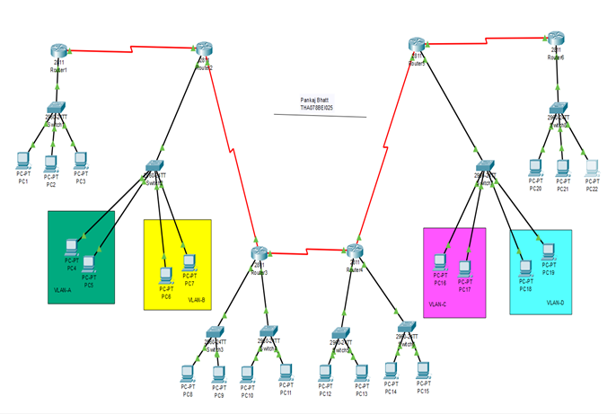

# Hierarchical Network Design 

*This project was completed for subject Computer Networks in my 5th Semester (2024) at Thapathali Campus, Institute of Engineering, Tribhuvan University*

---

## Introduction

This project demonstrates the design, configuration, and simulation of a hierarchical network topology using Cisco Packet Tracer. The network reflects a medium-scale campus or organizational environment, implementing VLAN segmentation, inter-VLAN routing, dynamic routing, DHCP, and basic router security.

---


## Network Architecture Overview



The network follows the three-tier hierarchical model:

- **Core Layer:** Routers interconnect network segments and route between VLANs, remote LANs, and serial links.
- **Distribution Layer:** Switches aggregate access layer traffic, enforce VLANs, and trunking.
- **Access Layer:** Switches connect end devices (PCs) and assign VLANs.

**Topology Features:**
- 6 routers interconnected via serial and Ethernet links
- Multiple switches for VLAN segmentation
- 4 VLANs (A, B, C, D)
- Router-on-a-Stick for inter-VLAN routing
- RIPv2 for dynamic routing
- DHCP for selected LANs
- Password security on routers

---

## VLAN Configuration and Addressing

| VLAN Name | VLAN ID | Subnet           | Gateway      |
|-----------|---------|------------------|--------------|
| VLAN-A    | 2       | 192.168.2.0/24   | 192.168.2.1  |
| VLAN-B    | 3       | 192.168.3.0/24   | 192.168.3.1  |
| VLAN-C    | 4       | 192.168.4.0/24   | 192.168.4.1  |
| VLAN-D    | 5       | 192.168.5.0/24   | 192.168.5.1  |

---

## Router-by-Router Interface IP Assignments

| Router | Interface   | IP Address        | Description      |
|--------|-------------|-------------------|------------------|
| R2     | Fa0/0.2     | 192.168.2.1/24    | VLAN-A Gateway   |
| R2     | Fa0/0.3     | 192.168.3.1/24    | VLAN-B Gateway   |
| R5     | Fa0/0.4     | 192.168.4.1/24    | VLAN-C Gateway   |
| R5     | Fa0/0.5     | 192.168.5.1/24    | VLAN-D Gateway   |
| R1     | Fa0/0       | 192.168.80.1/24   | DHCP LAN         |
| R3     | Fa0/0       | 192.168.40.1/24   | DHCP LAN         |
| R3     | Fa0/1       | 192.168.50.1/24   | DHCP LAN         |
| R4     | Fa0/0       | 192.168.60.1/24   | DHCP LAN         |
| R4     | Fa0/1       | 192.168.70.1/24   | DHCP LAN         |
| R6     | Fa0/0       | 192.168.90.1/24   | DHCP LAN         |

---


## Serial Link Addressing (/30)

| Serial Network   | Router A | Interface      | IP           | Router B | Interface      | IP           |
|------------------|----------|----------------|--------------|----------|----------------|--------------|
| 192.169.1.0/30   | R1       | Serial0/2/1    | 192.169.1.1  | R2       | Serial0/2/0    | 192.169.1.2  |
| 192.169.2.0/30   | R2       | Serial0/2/1    | 192.169.2.1  | R3       | Serial0/2/0    | 192.169.2.2  |
| 192.169.3.0/30   | R3       | Serial0/2/1    | 192.169.3.1  | R4       | Serial0/2/0    | 192.169.3.2  |
| 192.169.4.0/30   | R4       | Serial0/2/1    | 192.169.4.1  | R5       | Serial0/2/0    | 192.169.4.2  |
| 192.169.5.0/30   | R5       | Serial0/2/1    | 192.169.5.1  | R6       | Serial0/2/0    | 192.169.5.2  |

---

## DHCP Configuration

| Router | Network         | Gateway        | Excluded Address |
|--------|-----------------|---------------|------------------|
| R1     | 192.168.80.0/24 | 192.168.80.1  | 192.168.80.1     |
| R3     | 192.168.40.0/24 | 192.168.40.1  | 192.168.40.1     |
| R3     | 192.168.50.0/24 | 192.168.50.1  | 192.168.50.1     |
| R4     | 192.168.60.0/24 | 192.168.60.1  | 192.168.60.1     |
| R4     | 192.168.70.0/24 | 192.168.70.1  | 192.168.70.1     |
| R6     | 192.168.90.0/24 | 192.168.90.1  | 192.168.90.1     |

*Note: VLAN PCs use static IP addressing. DHCP is used only for the above router LANs.*

---

## Static IP Assignment for VLAN PCs

| VLAN | PC   | IP Address      | Gateway      |
|------|------|-----------------|--------------|
| A    | PC4  | 192.168.2.2/24  | 192.168.2.1  |
| A    | PC5  | 192.168.2.3/24  | 192.168.2.1  |
| B    | PC7  | 192.168.3.2/24  | 192.168.3.1  |
| C    | PC12 | 192.168.4.2/24  | 192.168.4.1  |
| D    | PC15 | 192.168.5.2/24  | 192.168.5.1  |

---

## Dynamic Routing (RIPv2)

RIPv2 is configured on all routers.

**RIP Networks per Router:**

- R1: 192.168.80.0, 192.169.1.0
- R2: 192.168.2.0, 192.168.3.0, 192.169.1.0, 192.169.2.0
- R3: 192.168.40.0, 192.168.50.0, 192.169.2.0, 192.169.3.0
- R4: 192.168.60.0, 192.168.70.0, 192.169.3.0, 192.169.4.0
- R5: 192.168.4.0, 192.168.5.0, 192.169.4.0, 192.169.5.0
- R6: 192.168.90.0, 192.169.5.0

---

## Switch Configuration Summary

- **Switch 2:** VLAN 2, 3 — trunk to Router 2
- **Switch 7:** VLAN 4, 5 — trunk to Router 5
- **Switches 3–6:** Access ports for DHCP LAN PCs

### Switch Port Assignments

| Switch   | Ports           | Assignment         | Network         |
|----------|-----------------|-------------------|-----------------|
| Switch 2 | Fa0/2 - Fa0/3   | VLAN 2 (Access)   | 192.168.2.0/24  |
| Switch 2 | Fa0/4 - Fa0/5   | VLAN 3 (Access)   | 192.168.3.0/24  |
| Switch 2 | Fa0/1           | Trunk (to Router 2)|                 |
| Switch 7 | Fa0/1 - Fa0/2   | VLAN 4 (Access)   | 192.168.4.0/24  |
| Switch 7 | Fa0/3 - Fa0/4   | VLAN 5 (Access)   | 192.168.5.0/24  |
| Switch 7 | Fa0/6           | Trunk (to Router 5)|                 |

---


## Security Configuration

Example (Router 1):

- Enable secret: `thapathali`
- Console password: `tha12345`
- VTY password: `bei2078`

All routers are configured with console, VTY, and enable authentication.

---

## Testing and Verification

- Intra-VLAN communication successful
- Inter-VLAN communication successful
- End-to-end inter-router connectivity verified
- DHCP lease assignment verified
- Router access protected by passwords

---

## Visual References

For additional screenshots, configuration examples, and simulation results, please refer to the `images` folder included in this repository. These images provide step-by-step visual guidance and verification for the network setup and testing.

---

## How to Run the Project

1. Install Cisco Packet Tracer
2. Open the provided pb.pkt file
3. Inspect router and switch configurations
4. Use PC command prompt to test connectivity

---

## Appendix: General Cisco CLI Commands Used

This section lists commonly used Cisco IOS commands for configuring VLANs, inter-VLAN routing, DHCP, dynamic routing, and basic security in a hierarchical network.

### 1. Basic Device Setup (Router / Switch)
```
enable
configure terminal
hostname <DEVICE_NAME>
no ip domain-lookup
```

### 2. VLAN Creation (Switch)
```
vlan <VLAN_ID>
 name <VLAN_NAME>
exit
```
**Example:**
```
vlan 2
 name VLAN-A
```

### 3. Assigning Access Ports to VLANs
```
interface <INTERFACE_ID>
 switchport mode access
 switchport access vlan <VLAN_ID>
 spanning-tree portfast
exit
```
**Example:**
```
interface fa0/2
 switchport mode access
 switchport access vlan 2
```

### 4. Configuring Trunk Ports
```
interface <INTERFACE_ID>
 switchport mode trunk
 switchport trunk allowed vlan <VLAN_LIST>
exit
```
**Example:**
```
interface fa0/1
 switchport mode trunk
 switchport trunk allowed vlan 2,3
```

### 5. Router-on-a-Stick (Inter-VLAN Routing)
```
interface <PHYSICAL_INTERFACE>.<VLAN_ID>
 encapsulation dot1Q <VLAN_ID>
 ip address <GATEWAY_IP> <SUBNET_MASK>
exit
```
**Example:**
```
interface fa0/0.2
 encapsulation dot1Q 2
 ip address 192.168.2.1 255.255.255.0
```

### 6. Assigning IP Address to Router Interface
```
interface <INTERFACE_ID>
 ip address <IP_ADDRESS> <SUBNET_MASK>
 no shutdown
exit
```

### 7. Serial Interface Configuration
```
interface <SERIAL_INTERFACE>
 ip address <IP_ADDRESS> <SUBNET_MASK>
 clock rate 64000     ! only on DCE side
 no shutdown
exit
```

### 8. DHCP Configuration (Router)
**Exclude Gateway Address:**
```
ip dhcp excluded-address <START_IP> <END_IP>
```
**Create DHCP Pool:**
```
ip dhcp pool <POOL_NAME>
 network <NETWORK_ADDRESS> <SUBNET_MASK>
 default-router <GATEWAY_IP>
exit
```
**Example:**
```
ip dhcp pool SUBNET80
 network 192.168.80.0 255.255.255.0
 default-router 192.168.80.1
```

### 9. Dynamic Routing Configuration (RIPv2)
```
router rip
 version 2
 no auto-summary
 network <NETWORK_ADDRESS>
exit
```
**Example:**
```
router rip
 version 2
 no auto-summary
 network 192.168.2.0
 network 192.169.1.0
```

### 10. Router Security Configuration
**Enable Password:**
```
enable secret <PASSWORD>
```
**Console Password:**
```
line console 0
 password <PASSWORD>
 login
exit
```
**VTY (Remote Access) Password:**
```
line vty 0 4
 password <PASSWORD>
 login
exit
```

### 11. Saving Configuration
```
write memory
```
or
```
copy running-config startup-config
```

### 12. Verification Commands
```
show ip interface brief
show vlan brief
show interfaces trunk
show ip route
show ip protocols
ping <DESTINATION_IP>
traceroute <DESTINATION_IP>
```
